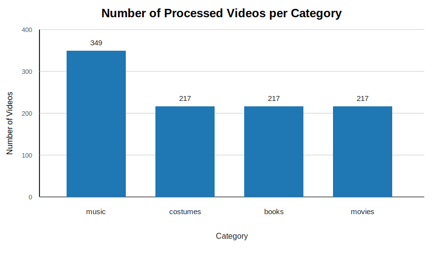
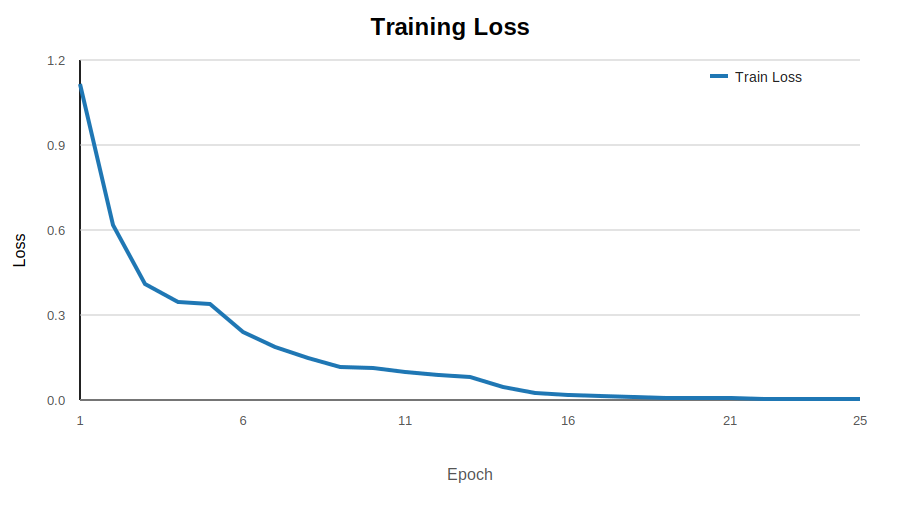
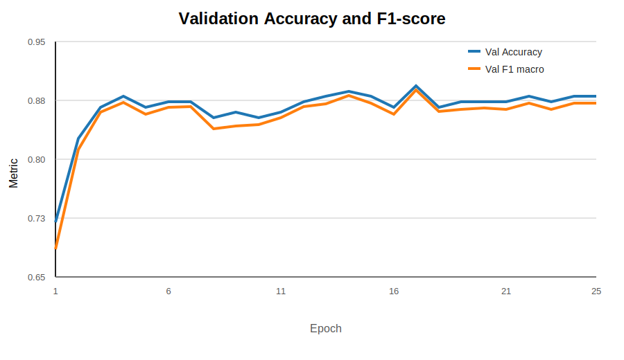
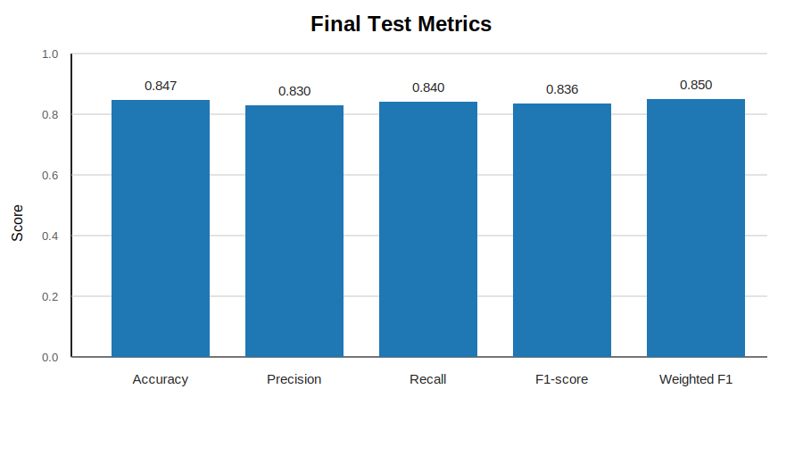
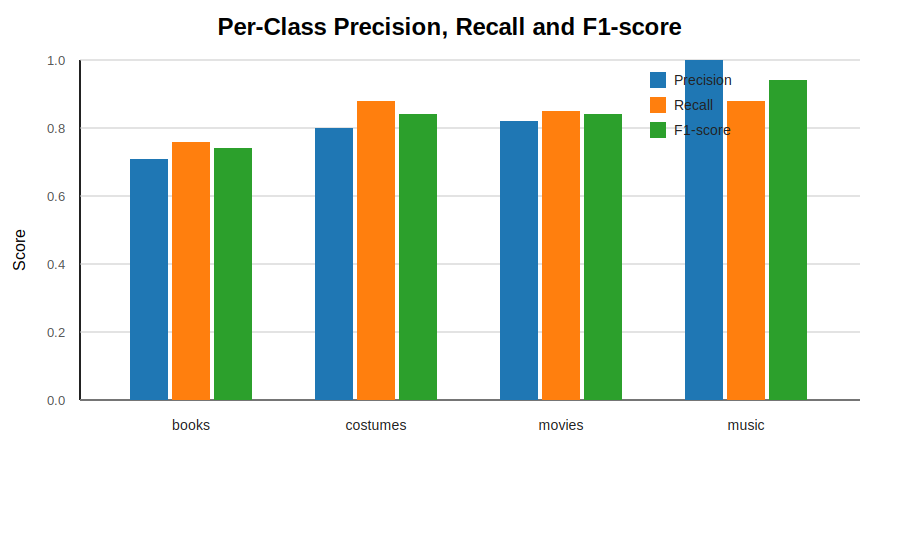

# Arts Video Classifier

Лабораторная работа по классификации видео из категории **Arts and Entertainment** набора данных HowTo100M. В проекте видео сначала преобразуются в предобученные CLIP-эмбеддинги изображений, а затем последовательности этих эмбеддингов классифицируются Transformer-моделью, обученной с нуля.

## Вариант

Выполнен **вариант 3** лабораторной работы.

| Пункт варианта | Значение |
|---|---|
| Задача | Классификация видео |
| Датасет | HowTo100M, раздел `Arts and Entertainment` |
| Визуальные признаки | Предобученные эмбеддинги изображений |
| Использованная модель для визуальных признаков | CLIP `openai/clip-vit-base-patch32` |
| Модель классификации | Transformer, обученный с нуля |

## Кратко о задаче

Цель работы: построить классификатор видео по тематическим подкатегориям раздела Arts из HowTo100M.

Вариант лабораторной предполагает:

| Требование | Реализация в проекте |
|---|---|
| Данные | HowTo100M, категория `Arts and Entertainment` |
| Входные признаки | Предобученные эмбеддинги изображений |
| Модель эмбеддингов | `openai/clip-vit-base-patch32` |
| Классификатор | Transformer Encoder |
| Обучение классификатора | С нуля, только на собранных видеоэмбеддингах |
| Платформа | Google Colab |
| Итоговый датасет | 1000 успешно обработанных видео |

## Идея решения

Исходный HowTo100M содержит метаданные и YouTube `video_id`, но не хранит сами видео в удобном готовом виде. Поэтому пайплайн был построен так, чтобы не занимать много места на диске:

1. Из CSV-файла HowTo100M выбираются ролики из категории `Arts and Entertainment`.
2. Для каждого ролика формируется YouTube-ссылка.
3. Ссылки проверяются через `yt-dlp`.
4. Рабочие ролики скачиваются по одному во временный файл.
5. Из каждого видео извлекаются 16 кадров.
6. Каждый кадр пропускается через предобученный CLIP.
7. Для одного видео сохраняется тензор эмбеддингов размера `16 x 512`.
8. Временный видеофайл удаляется.
9. На готовых эмбеддингах обучается Transformer-классификатор.

Такой подход позволяет не хранить исходные видео постоянно: в проекте сохраняются только маленькие `.pt` файлы с эмбеддингами и итоговая модель.

## Структура проекта

```text
laba2_project/
  README.md
  requirements.txt
  .gitignore

  src/
    collect_working_links.py
    make_embeddings_from_links.py
    train_transformer_on_embeddings.py

  data/
    arts_video_links.csv
    arts_working_links.csv
    arts_checked_links.csv
    embeddings_manifest.csv

  embeddings/
    books/
    costumes/
    movies/
    music/

  models/
    best_model.pt

  results/
    model_results/
      results.json
      metrics.json
      classification_report.txt
      confusion_matrix.csv
      history.csv
      training_history.csv
      train_split.csv
      val_split.csv
      test_split.csv
      labels.json
      processed_videos_per_category.svg
      training_loss.svg
      validation_accuracy_f1.svg
      final_test_metrics.svg
      per_class_metrics.svg
```

Назначение основных папок:

| Папка | Назначение |
|---|---|
| `src/` | Python-скрипты для проверки ссылок, извлечения эмбеддингов и обучения модели |
| `data/` | CSV-файлы со ссылками, статусами проверки и манифестом эмбеддингов |
| `embeddings/` | Готовые CLIP-эмбеддинги видео в формате `.pt` |
| `models/` | Сохраненная лучшая Transformer-модель |
| `results/model_results/` | Метрики, история обучения, confusion matrix и train/val/test split |

## Описание скриптов

### `src/collect_working_links.py`

Скрипт проверяет YouTube-ссылки из `arts_video_links.csv` и сохраняет:

| Файл | Что хранит |
|---|---|
| `arts_working_links.csv` | Ссылки, которые удалось проверить как доступные |
| `arts_checked_links.csv` | Все проверенные ссылки: успешные и неуспешные |

Проверка выполняется через `yt-dlp --simulate`, то есть видео при этом не скачивается полностью.

### `src/make_embeddings_from_links.py`

Скрипт создает CLIP-эмбеддинги:

1. Читает `arts_working_links.csv`.
2. Пропускает уже обработанные `video_id` из `embeddings_manifest.csv`.
3. Скачивает одно видео во временный файл.
4. Извлекает 16 кадров.
5. Получает CLIP-эмбеддинги размерности 512 для каждого кадра.
6. Сохраняет `.pt` файл в `embeddings/<label>/<video_id>.pt`.
7. Записывает результат в `embeddings_manifest.csv`.
8. Удаляет временное видео.

Один объект классификации представлен матрицей:

```text
16 кадров x 512 признаков
```

### `src/train_transformer_on_embeddings.py`

Скрипт обучает Transformer-классификатор:

1. Читает `embeddings_manifest.csv`.
2. Берет только строки со статусом `ok`.
3. Находит соответствующие `.pt` файлы.
4. Делит данные на `train`, `val` и `test`.
5. Обучает Transformer Encoder с нуля.
6. Выбирает лучшую модель по `val_f1_macro`.
7. Сохраняет модель и итоговые метрики.

## Использованные технологии

| Компонент | Назначение |
|---|---|
| Python | Основной язык реализации |
| PyTorch | Обучение Transformer-модели |
| Transformers | Загрузка CLIP |
| CLIP | Получение предобученных image embeddings |
| OpenCV | Извлечение кадров из видео |
| yt-dlp | Проверка и скачивание YouTube-видео |
| scikit-learn | Train/val/test split и метрики |
| pandas | Работа с CSV |
| Google Colab | Запуск пайплайна и обучение |

## Подготовка окружения

Проект рассчитан на запуск в Google Colab. Для установки зависимостей:

```bash
pip install -r requirements.txt
```

В Colab удобнее запускать так:

```python
!pip install -q numpy pandas torch scikit-learn opencv-python pillow transformers tqdm yt-dlp safetensors
```

Если используется GPU, PyTorch автоматически выберет `cuda`. Если GPU недоступен, скрипты могут работать на CPU, но извлечение CLIP-эмбеддингов будет заметно медленнее.

## Запуск пайплайна

### 1. Проверка рабочих ссылок

```python
!python /content/collect_working_links.py
```

Скрипт поддерживает продолжение работы: уже проверенные ссылки повторно не проверяются.

### 2. Извлечение эмбеддингов

```python
!python /content/make_embeddings_from_links.py
```

Скрипт также поддерживает продолжение работы. Если в `embeddings_manifest.csv` уже есть успешная запись для видео, оно не обрабатывается повторно.

### 3. Обучение модели

```python
!python /content/train_transformer_on_embeddings.py
```

После обучения появляются:

| Файл | Содержимое |
|---|---|
| `models/best_model.pt` | Лучший checkpoint модели |
| `results/model_results/results.json` | Итоговые метрики и отчет |
| `results/model_results/classification_report.txt` | Classification report |
| `results/model_results/confusion_matrix.csv` | Матрица ошибок |
| `results/model_results/history.csv` | История обучения по эпохам |
| `results/model_results/train_split.csv` | Обучающая выборка |
| `results/model_results/val_split.csv` | Валидационная выборка |
| `results/model_results/test_split.csv` | Тестовая выборка |

## Данные

После фильтрации, проверки ссылок и извлечения признаков получилось 1000 валидных видеоэмбеддингов. Для обучения были оставлены четыре наиболее представленных и устойчивых класса раздела `Arts and Entertainment`: `books`, `costumes`, `movies` и `music`.

Распределение по классам:

| Класс | Количество видео |
|---|---:|
| `music` | 349 |
| `costumes` | 217 |
| `books` | 217 |
| `movies` | 217 |
| **Итого** | **1000** |

Разбиение на выборки:

| Выборка | Количество |
|---|---:|
| Train | 700 |
| Validation | 150 |
| Test | 150 |
| **Total used** | **1000** |

Разбиение выполнялось стратифицированно: в `train`, `validation` и `test` сохранялось примерно одинаковое соотношение подкатегорий.

| Класс | Train | Validation | Test | Всего |
|---|---:|---:|---:|---:|
| `books` | 152 | 32 | 33 | 217 |
| `costumes` | 152 | 33 | 32 | 217 |
| `movies` | 152 | 32 | 33 | 217 |
| `music` | 244 | 53 | 52 | 349 |
| **Итого** | **700** | **150** | **150** | **1000** |

График распределения обработанных видео:



## Архитектура модели

Классификатор принимает последовательность из 16 CLIP-эмбеддингов:

```text
video -> 16 frames -> CLIP -> tensor [16, 512] -> Transformer -> class
```

Основные параметры обучения:

| Параметр | Значение |
|---|---:|
| Input shape | `16 x 512` |
| Number of classes | 4 |
| Batch size | 32 |
| Epochs | 25 |
| Learning rate | `1e-4` |
| Weight decay | `1e-4` |
| Optimizer | AdamW |
| Loss | CrossEntropyLoss with class weights |
| Best model criterion | `val_f1_macro` |

## Результаты

Итоговые метрики на тестовой выборке:

| Метрика | Значение |
|---|---:|
| Test accuracy | 0.8467 |
| Test F1 macro | 0.8364 |
| Macro precision | 0.83 |
| Macro recall | 0.84 |
| Weighted F1-score | 0.85 |
| Best validation accuracy | 0.8933 |
| Best validation F1 macro | 0.8885 |
| Test size | 150 |

История обучения по эпохам:

| Epoch | Train loss | Val accuracy | Val F1 macro |
|---:|---:|---:|---:|
| 1 | 1.1144 | 0.7200 | 0.6857 |
| 2 | 0.6167 | 0.8267 | 0.8121 |
| 3 | 0.4098 | 0.8667 | 0.8596 |
| 4 | 0.3453 | 0.8800 | 0.8720 |
| 5 | 0.3375 | 0.8667 | 0.8575 |
| 6 | 0.2403 | 0.8733 | 0.8661 |
| 7 | 0.1860 | 0.8733 | 0.8673 |
| 8 | 0.1474 | 0.8533 | 0.8388 |
| 9 | 0.1176 | 0.8600 | 0.8428 |
| 10 | 0.1128 | 0.8533 | 0.8445 |
| 11 | 0.1004 | 0.8600 | 0.8530 |
| 12 | 0.0894 | 0.8733 | 0.8675 |
| 13 | 0.0821 | 0.8800 | 0.8709 |
| 14 | 0.0459 | 0.8867 | 0.8812 |
| 15 | 0.0262 | 0.8800 | 0.8717 |
| 16 | 0.0171 | 0.8667 | 0.8572 |
| 17 | 0.0128 | 0.8933 | 0.8885 |
| 18 | 0.0098 | 0.8667 | 0.8597 |
| 19 | 0.0086 | 0.8733 | 0.8633 |
| 20 | 0.0059 | 0.8733 | 0.8646 |
| 21 | 0.0056 | 0.8733 | 0.8633 |
| 22 | 0.0043 | 0.8800 | 0.8717 |
| 23 | 0.0037 | 0.8733 | 0.8633 |
| 24 | 0.0035 | 0.8800 | 0.8717 |
| 25 | 0.0031 | 0.8800 | 0.8717 |

График функции потерь:



График accuracy и F1-score на validation:



Итоговые метрики на тестовой выборке:



Classification report:

| Класс | Precision | Recall | F1-score | Support |
|---|---:|---:|---:|---:|
| `books` | 0.71 | 0.76 | 0.74 | 33 |
| `costumes` | 0.80 | 0.88 | 0.84 | 32 |
| `movies` | 0.82 | 0.85 | 0.84 | 33 |
| `music` | 1.00 | 0.88 | 0.94 | 52 |
| **Accuracy** |  |  | **0.85** | **150** |
| **Macro avg** | **0.83** | **0.84** | **0.84** | **150** |
| **Weighted avg** | **0.86** | **0.85** | **0.85** | **150** |

Метрики по классам:



## Анализ результатов

Модель достигла точности `84.7%` и `macro F1 = 83.6%` на тестовой выборке. Близкие значения accuracy и macro F1 показывают, что качество не определяется только самым крупным классом: модель достаточно устойчиво работает по всем четырем категориям.

Лучше всего модель распознает:

| Класс | F1-score |
|---|---:|
| `music` | 0.94 |
| `costumes` | 0.84 |
| `movies` | 0.84 |

Класс `music` имеет максимальную precision `1.00`: если модель относит видео к музыке, она почти не ошибается. При этом recall для `music` равен `0.88`, то есть часть музыкальных видео все же переходит в соседние классы.

Наиболее сложным оказался класс `books`: его F1-score равен `0.74`. Это может быть связано с тем, что визуально видео про книги часто содержат общие сцены: людей, столы, интерьер, обложки, презентации. Такие кадры могут быть менее однозначными для классификации только по визуальным признакам.

История обучения показывает, что `train_loss` снизился с `1.1144` до `0.0031`, то есть модель уверенно выучила обучающую выборку. Лучшее качество на validation было достигнуто на 17-й эпохе: `val_accuracy = 0.8933`, `val_f1_macro = 0.8885`. После этого train loss продолжил уменьшаться, но validation-метрики держались примерно на одном уровне, что указывает на начало переобучения и подтверждает необходимость выбора лучшего checkpoint по `val_f1_macro`.


## Вывод

В рамках лабораторной работы был реализован полный пайплайн классификации видео:

1. Извлечение ссылок из HowTo100M.
2. Проверка доступности YouTube-видео.
3. Последовательное скачивание видео без постоянного хранения.
4. Извлечение 16 кадров из каждого ролика.
5. Получение предобученных CLIP-эмбеддингов.
6. Обучение Transformer-классификатора с нуля.
7. Оценка модели на тестовой выборке.

Итоговая модель обучена на 1000 видеоэмбеддингах и достигла `84.7%` accuracy и `83.6%` macro F1 на тестовой выборке. Основное преимущество итогового эксперимента в том, что качество получилось сбалансированным по классам: модель хорошо распознает не только самый крупный класс `music`, но и категории `costumes`, `movies` и `books`.

## Загрузка проекта на GitHub


Команды для первого коммита:

```bash
git init
git add .
git commit -m "Initial commit"
git branch -M main
git remote add origin https://github.com/<your-username>/arts-video-classifier.git
git push -u origin main
```

После создания пустого репозитория на GitHub:

```bash
git branch -M main
git remote add origin https://github.com/<your-username>/arts-video-classifier.git
git push -u origin main
```

